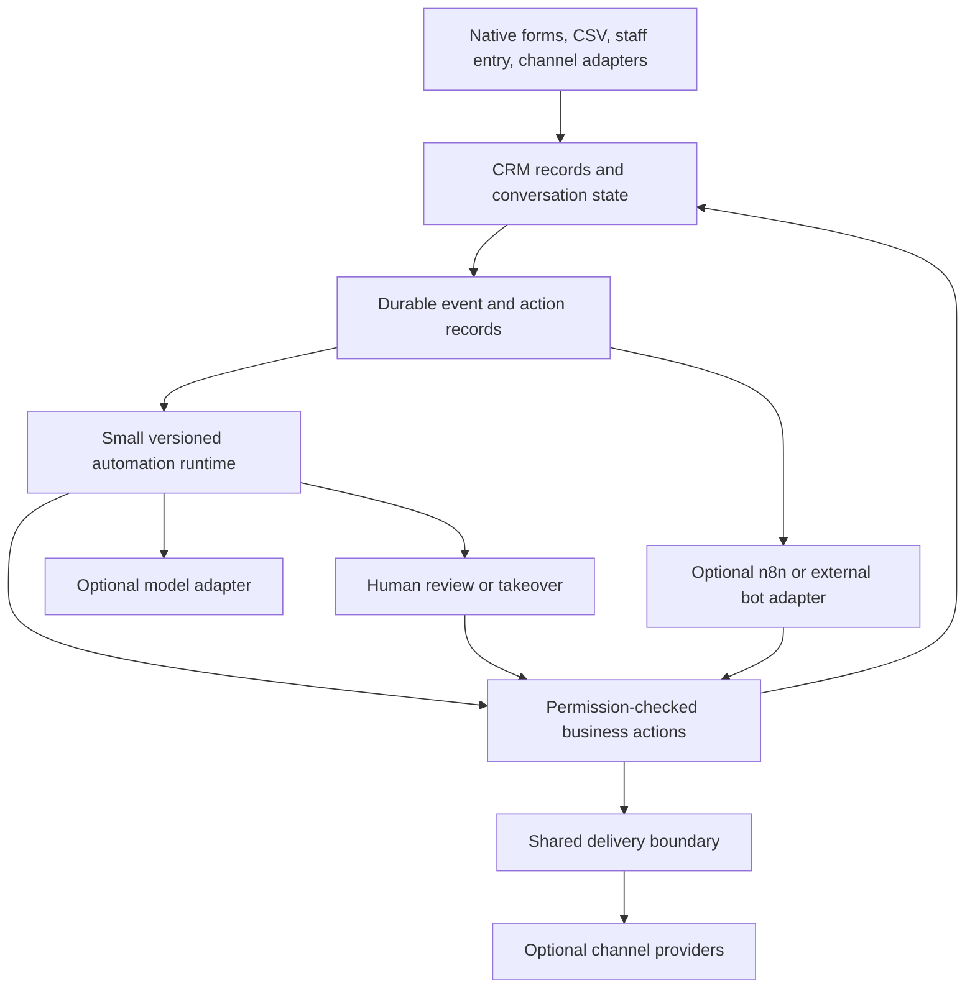

# CRM architecture and business decision — 2026-09-09

**Recommendation:** own the CRM data, conversation ownership and a small, durable automation runtime. Keep n8n and AI providers replaceable. Ship useful manual funnels with no external connections. Extend the existing implementation in stages; avoid building a general-purpose workflow platform or replacing the inbox now.

This is a source audit with selected lab verification and a local candidate patch. It is **not a certification that every vertical, channel or production tenant works**. “Never broken” must mean explicit failure behavior, measurable reliability and enforced release gates.

The fresh [Clínica wiring contract](/home/holymc2/muelle-host/clinica/docs/CRM_VERTICAL_INTEGRATION.md) is now incorporated below. [Concise build tasks and acceptance checks](CRM_BUILD_TASKS_2026-09-09.md) are the delivery queue; they distinguish implemented candidates from the remaining program.

## Evidence and scope

- Candidate: `audit/crm-standalone-20260909`, based on local `doco-dev` at `210c1a44a`. The original active CRM branch was `fix/social-editorial-quality` at `39dfc2535`, one build fix behind. Both original worktrees were preserved.
- Public upstream fetched September 9: `frappe/crm` develop `79aaacab3`; main `52c500d6b`. Before the candidate patches, the fork had **398 commits unique to it and 179 unique to upstream develop**, with common ancestor `177a781e4` dated August 4. These are ancestry counts, not counts of missing features or patch-equivalent changes.
- Marketing backend reviewed read-only at `a475a11`; relevant Doco forms, vertical definitions and Abordo presets also inspected.
- Follow-on source bases: Doco `52893e8`, Clínica `0c70011`, Taller `e1b2bb0e`. Clínica's September 9 document corrects the earlier incomplete clinic inventory: patient intake, saved profiles, agenda and durable consented reminders already exist. Its lab includes Healthcare and Clínica, with neither Taller nor marketing.
- Actual generic lab app list: Frappe 16.31.0, ERPNext 16.32.0, Doco, POSAwesome, CRM and Print Designer. **No `doco_marketing` and no `taller`.** Thus existing normal configurations already exercise the optional-app problem.
- Fable built the initial capability/router/desktop navigation patch. Codex reviewed it, found mobile and deal-creation gaps, corrected those locally, selected upstream changes and ran checks. Automatic approval review rejected a separate backend audit and a follow-up Fable call over private-source transmission; those reviews/corrections stayed local.

## Findings that change the business decision

| Priority | Finding and evidence | Consequence / disposition |
|---|---|---|
| P1 | Home originally always opened Inbox; custom routes and nav called `doco_marketing` despite its absence on the generic demo. See [router](../frontend/src/router.js), [capability boundary](../frontend/src/utils/crmCapabilities.js). | Standalone was not a dependable product contract. Candidate routes missing-addon tenants to native CRM lists and gates desktop/mobile nav and badge requests. End-to-end browser acceptance remains open. |
| P1 | [DealModal](../frontend/src/components/Modals/DealModal.vue) always mounted repair intake, fetched Doco customer defaults, hid organization fields and launched ERP sync. [VerticalSlot](../frontend/src/components/doco/VerticalSlot.vue) unconditionally requested Taller's vertical API. | Non-repair and bare CRM tenants inherited repair assumptions. Candidate gates extensions by installed requirements, restores organization inputs outside the repair path, and reports a failed optional customer sync after a saved deal. Atomic deal-plus-repair creation remains a separate improvement. |
| P1 | Marketing's [hooks](/home/holymc2/muelle-host/doco_marketing/doco_marketing/hooks.py:12) require `crm`, `doco`, `frappe_whatsapp`, **and `mercado`**. | The optional-app packaging is broader than the intended manual-funnel product. Core CRM must not require this app. Later separate channel-neutral automation dependencies from provider/storefront adapters; do not merely remove `required_apps` and hope schemas still load. |
| P1 | [Chatflow advancement](/home/holymc2/muelle-host/doco_marketing/doco_marketing/services/chatflow.py:345) reads the current mutable flow and a positional `next_step`. Human attendance is checked when starting, using a [30-minute outgoing-message heuristic](/home/holymc2/muelle-host/doco_marketing/doco_marketing/services/chatflow.py:515), not on each advance. | Editing a live flow can change an existing run. A human taking over does not durably pause that chatflow. Cadences already stop on inbound replies, so the engines have different semantics. Need immutable run versions and explicit bot/human ownership checked before each action. Confirmed source gaps; no live customer incident asserted. |
| P1 | [Chatflow deduplication](/home/holymc2/muelle-host/doco_marketing/doco_marketing/services/chatflow.py:95) checks existence before insert. Runs have hash names without an execution-key uniqueness constraint; [start_run](/home/holymc2/muelle-host/doco_marketing/doco_marketing/services/chatflow.py:279) executes the entry step before recording the run. | Concurrent matching events can create duplicate drafts/runs. The existing atomic claim protects scheduled advancement, not initial enrollment. Reproduce with concurrent transactions before changing schema. |
| P1 | [Template review sends](/home/holymc2/muelle-host/doco_marketing/doco_marketing/marketing/doctype/whatsapp_send_review/whatsapp_send_review.py:53), [free-text review sends](/home/holymc2/muelle-host/doco_marketing/doco_marketing/marketing/doctype/inbox_auto_reply/inbox_auto_reply.py:32) and the [dispatch runner](/home/holymc2/muelle-host/doco_marketing/doco_marketing/services/dispatch/runner.py:78) have different execution paths. Provider calls can happen before the database records success. | A crash after provider acceptance can leave local state uncertain and permit duplicate retries. A persisted `wa_message` guard and queue job dedup help but cannot close this crash window. Need durable action identity, atomic claims and an explicit unknown-delivery outcome. Failure injection remains unrun. |
| P1 | [Chatflow suppression lookup](/home/holymc2/muelle-host/doco_marketing/doco_marketing/services/chatflow.py:32) returns false on exceptions. Review rows can be approved later; template `_send` has no fresh suppression check, while free-text review uses `inbox.send_message` with its default `marketing=False`. | An automation can be staged during a suppression-service error, or approved after the recipient opts out. Centralize the final eligibility check immediately before automated dispatch, with distinct transactional/service and marketing policies. This is a source finding, not a claim that a prohibited message was sent. |
| P2 | [Broadcast finalization](/home/holymc2/muelle-host/doco_marketing/doco_marketing/services/dispatch/runner.py:132) sets `Sent` when no automatic-channel rows remain Pending, even if they Failed/Skipped. The [dispatch lock](/home/holymc2/muelle-host/doco_marketing/doco_marketing/services/dispatch/runner.py:21) has a constant server-wide MariaDB advisory-lock name. | Completion reporting can overstate success; slow work on one database can serialize another tenant sharing that MariaDB server. Aggregate outcomes honestly and namespace execution locks by site. Neither requires a new workflow platform. |

Follow-on corrections: native Lead/Deal/ViewControls now offer the marketing-owned silent action only when that app is present. An ordinary save is deliberately not called “silent”: Taller can still notify without marketing. Activities gates optional requests/realtime reloads, retains native timelines and supports configured WhatsApp without starting marketing resources. Contact 360 stops requesting unavailable addon tabs. The compiled vertical shell now calls a CRM-owned compatibility endpoint, which uses Doco's new discovery registry and preserves eligible legacy sections. Full deep-link/browser acceptance remains open.

## Clinic wiring folded into the architecture

The clinic document is the domain authority for identity and privacy boundaries. CRM Lead remains an inquiry, Deal an opportunity/case, Contact a communication identity, Customer a billing identity and Patient the canonical clinical identity. Guardians, payers and patients may differ. Matching phone/email never proves a patient link. Appointment booking remains Clínica's agenda operation; it does not create a second CRM appointment model or a Deal for every visit.

The current candidate implements the read-only portion of its provider proposal:

- Doco resolves `crm_vertical_providers` only from installed apps, rejects duplicate identifiers before import, checks app-owned paths, projects bounded schema-1 descriptors and contains provider failures. CRM role and optional entity-read checks precede discovery. Permissions are recomputed per request; private responses are not site-cached.
- Clínica registers `clinica:clinic`; Taller registers `taller:repair`. Both can contribute regardless of the preferred vertical. CRM maps a fixed component key to its compiled workspace card; routes are allowlisted. No provider-selected Python call, arbitrary URL, Patient lookup or clinical projection is exposed.
- Clínica reuses its own staff and settings checks. Agenda availability follows the existing agenda role/DocType gates. Dental is `disabled` or `demo_only`; inpatient is unavailable even under the hospital preset. Current presets stay `consultorio`, `dental`, `clinica`, `hospital`; family medicine is a later specialty template.
- The new [CRM compatibility endpoint](../crm/api/capabilities.py) remains callable without Doco and supports old Doco versions through the legacy layout path. Repair sections require Taller, and the documents section requires its actual marketing/ERP dependencies. Personalized cards refresh on focus and within 60 seconds while visible; obsolete responses cannot restore a previous context's cards.

Do not copy clinical notes, diagnoses, histories, dental findings, images, signed forms or attachment URLs into CRM, marketing segmentation, generic logs, browser outbox or realtime payloads. Workspace navigation carries no patient identity. Marketing consent, service-message permission, patient-reminder consent and channel suppression remain separate. Existing clinic delivery claims and unknown outcomes are useful implementation evidence for the future shared delivery boundary; do not replace them with the browser outbox's weaker retry behavior.

The provider registry does not finish clinic onboarding. Boat/Muelle health bundles currently install Healthcare without the new Clínica app; Abordo does not seed its saved subprofile. The next provisioning task must install it explicitly in the health path, carry validated profile intent, preserve later administrator overrides on replay and retain step receipts. Identity linking, conversion receipts, authorized schedule projections and event outbox follow with concurrency/rollback tests. `context` and `execute` remain proposed APIs, not implemented endpoints.

## What to keep and build upon

There is considerable reusable product code: Inbox, Chatflow/Chatflow Run, campaign enrollments and cadences, assignment and SLA logic, two supervised reply queues, Marketing Send Log, provider adapters, consent/suppression records, repair follow-ups and a channel ladder.

The [channel ladder](/home/holymc2/muelle-host/doco_marketing/doco_marketing/services/channel/ladder.py) already supports a manual WhatsApp deeplink and connected WABA mode. Its package explicitly avoids calling a deeplink a successful send. Preserve that honesty: clicking a link proves an operator opened a messaging app, not delivery, attribution or a reply. An unconfigured provider already leaves dispatch rows Pending with a reason; retain and improve that visible degradation.

The desired product levels should be:

| Mode | What works | What requires a connection |
|---|---|---|
| CRM only | Leads, contacts, organizations, deals/stages, tasks, notes, imports, native public forms, manual source tracking | No external API required; Frappe/server/database still required |
| Local automation | Assignment, tasks, stage rules, waits, reminders, human approvals, run history | No external orchestrator or LLM required |
| Manual messaging | Draft a message, open WhatsApp, record an operator-reported outcome | Automatic ingestion and delivery confirmation are unavailable |
| Connected channels | Shared message history, provider sends/receipts, channel-aware eligibility | Each channel's configured, healthy provider |
| AI assistance/bots | Summaries, extraction, suggested replies, controlled actions | A configured model for AI steps; failure must leave manual handling usable |

“Without connections” does not mean an autonomous WhatsApp bot can operate without WhatsApp transport. It means acquisition, pipeline work and manual follow-up retain independent value.

## Architecture with the lowest maintenance risk

Use the existing Frappe deployment, MariaDB records and background workers. Establish module boundaries before introducing services or a second database.

CRM owns customer/deal truth, permissions, conversation history and ownership. Vertical modules own their business operations. Bots request bounded actions through those modules; they do not directly mutate arbitrary DocTypes, execute arbitrary Python/JavaScript or invent prices, inventory and payment status.

Start with a finite action vocabulary: assign, set an allowed field, add a task/note, wait, branch, propose a reply, send an eligible approved/template message, and hand off. AI is one optional step that returns structured suggestions. Authoring can use a guided recipe editor; a visual graph can come later if paying customers actually need it.

Converge existing Chatflows and Cadences on shared execution/delivery rules incrementally. Keep current API names and stored rows working through adapters. Avoid creating a third independent automation engine alongside them. Add a run version, event/action key, attempt state and expected conversation version only where the existing records need them; the migration must preserve active runs and allow rollback.

The essential execution rules are:

1. Commit the originating CRM change and durable event/action intent together. Queue workers after commit; sweep for committed work that was never enqueued.
2. Use unique event/action identities and transactional claims. Design for at-least-once execution. Where a provider cannot deduplicate or resolve acceptance after a timeout, mark the result uncertain and require reconciliation instead of blind retry.
3. Persist conversation ownership (`bot`, `human`, `paused`, `closed`) and its version. Recheck it, recipient eligibility and permissions immediately before sending. A delayed AI response must lose authority after a human takes over.
4. Publish immutable flow versions; existing runs retain their original version. Cancellation and rollback must have defined behavior for already accepted external sends.
5. Bound steps, runtime, retries, concurrent runs and AI spend per tenant. Keep retryable, blocked, terminal and uncertain failures distinct, with visible recovery controls.
6. Use scoped bot identities and typed business actions. Conversation text is input data, never authorization. Provide draft-only rollout, audit history and tenant-level pause controls.

These rules add operational discipline to existing functionality. A generic plugin marketplace, arbitrary code nodes, a home-grown LLM framework, separate microservices and a new universal form engine would add obligations before evidence of demand.

## n8n, Chatwoot and competition

| Choice | Benefit | Liability | Decision |
|---|---|---|---|
| n8n as mandatory product runtime | Fast access to many integrations | Another operational failure domain; workflow drift; tenant credential handling; commercial embedding terms | Avoid as the core dependency |
| Build a general-purpose workflow platform | Full control | Very large editor/runtime/security/support surface | Avoid |
| Small native runtime plus optional adapters | Own the customer promise; reuse current workers and business APIs; integrations remain replaceable | Requires careful execution semantics and strict action scope | Recommended |
| Replace the existing inbox with Chatwoot now | Reuse a mature conversation product | Contact/history/ownership synchronization and a second operating stack | No demonstrated need for this migration now |

Chatwoot's documented AgentBot model uses conversation webhooks and reply APIs with human handoff. Adopt that separation: external bots should consume events and call authorized actions without becoming the owner of CRM state. [Chatwoot AgentBot documentation](https://www.chatwoot.com/hc/user-guide/articles/1677497472-how-to-use-agent-bots).

n8n can remain useful for internal experiments, customer-owned workflows and unusual integrations. Do not assume embedding its workflow UI and managing customer credentials are covered by free internal-use terms; n8n's own guidance distinguishes these uses and describes a commercial Embed license for the exposed product model. The exact commercial architecture needs terms confirmed before commitment. [n8n licensing guidance](https://support.n8n.io/article/can-i-use-your-license-for-my-use-case).

Zoho already documents agents with triggers, defined context, roles and audit identities; monday documents integrated agents, outreach, summaries and human handoff. Those make basic AI labels a weak differentiator. [Zoho agent configuration](https://help.zoho.com/portal/en/kb/crm/zia-artificial-intelligence/nextgen-agentic-ai/articles/setting-up-agents-26-4-2026), [monday CRM AI features](https://support.monday.com/hc/en-us/articles/25548698480914-monday-CRM-s-AI-features).

**Business inference:** Muelle's more defensible proposition is a complete Spanish-language operational workflow connected to its existing commerce, repair, clinic and accounting systems. Prove three sales/service recipes first: new inquiry to assigned next action; quote follow-up that stops on response; repair-ready/payment follow-up with a clear human handoff. Run clinic reception as a separate pilot using its existing patient-intake, agenda and reminder boundaries. Services is a useful non-inventory compatibility case. All six presets share core CRM acceptance, while each specific workflow requires its own evidence; clinical follow-up decisions must not inherit sales-oriented close-deal automation.

Track activated tenants, inquiries receiving a next action, quote conversion, handoff success, duplicate/incorrect sends, recovery time and support minutes per tenant. Price automation against hosting, model usage, channel fees and support costs. Avoid unlimited AI promises before measuring the actual cost of successful customer workflows.

## Forms and selective upstream adoption

Public **CRM Forms already exist in this fork**: the builder stores native Frappe Web Forms, and CRM enriches Lead/Deal submissions. Upstream documents hosted and embedded acquisition forms with publishing controls. [Frappe CRM Forms](https://docs.frappe.io/crm/capturing-leads/web-form).

Doco's [forms compiler](/home/holymc2/muelle-host/doco/doco/forms/api.py) addresses authenticated operational intake and shared descriptors; its [CRM layout adapter](/home/holymc2/muelle-host/doco/doco/forms/crm_layout_import.py) reuses existing layouts. These have different trust boundaries and should not be collapsed into one new form system in this release. Preserve public-field allowlists and the existing native storage/submission boundary.

Selected changes imported into the candidate:

| Upstream commit(s) | Result |
|---|---|
| `4694aa288` | Preserve author session while previewing Guest-select Link options |
| `1c3cabf5b`, `0e86b0c17`, `7afd7b54a`, `d8f53dd9f` | Conditional form fields, corresponding preview behavior, embedded-form reset, tested public expression parser |
| `bd1c3bd86` | Validate visible/hidden field mappings server-side instead of trusting the builder payload |
| `f4be22587`, `4ce0f7815` | Require deal read permission before returning contacts, plus regression test |
| `ca0d6101b`, `7bd3c4e4f`, `2a82a539b` | Gate call logs and linked records, batch permitted lookups without truncation, plus tests |
| `9bd0aed58`, `42662dab8` | Keep authorized deal history usable when its source lead is unreadable; surface load failures. Adapted two contexts to preserve fork changes. |
| `83e5c975f` | Filter activity field changes by readable permission level, plus upstream tests |

These are selected patches, not a merge of develop or a deployment. Before enabling conditional forms broadly, add real browser submission tests for hidden/required/read-only combinations; parser tests alone are insufficient. Keep local overrides and upstream provenance in a small patch ledger. Review upstream regularly, prioritizing correctness/security, then targeted features. Defer the newer field renderer, broad enrichment changes and unrelated UI redesign until each has a concrete benefit and regression budget.

## Release gates and implementation order

The current preset registry lists `retail_general`, `ropa_moda`, `servicios`, `restaurante`, `repair_shop` and `clinica`. One CRM core should support each; preset existence is not end-to-end proof.

| Gate | Required proof before the associated promise |
|---|---|
| Standalone core | Fresh Frappe+CRM site: login, Lead/Deal CRUD, conversion, organization, task/note, filters, forms and reopen/reload; no optional-app RPCs. Repeat desktop/mobile with restricted roles. |
| Vertical compatibility | Run those core journeys for every preset, plus its specific business operation; verify absent Taller/ERP/channel schemas and selected capability combinations. |
| Disconnected channels | Add-on absent, installed but unconfigured, configured but failing, then recovered. Manual work remains usable; pending/failed state stays visible; no fabricated send success. |
| Bot safety and recovery | Concurrent duplicate event, restart between claim/send/recording, stale reply after handoff, opt-out after staging, edited flow, failed queue enqueue, quota exhaustion and provider timeout. |
| Release and rollback | Targeted permission tests, complete PWA assets, authenticated browser journeys, migration preservation, backup/restore and canary rollback. |

**Sequence:** (1) standalone, Forms/permissions and provider discovery; (2) clinic provisioning and verified identity actions, alongside existing execution/delivery safeguards; (3) pilot bounded recipes in draft/review mode and authorized clinic reception; (4) enable explicitly permitted automatic actions after fault tests and pilot evidence; (5) add external/n8n adapters when a customer need justifies one. The [task queue](CRM_BUILD_TASKS_2026-09-09.md) assigns owners, dependencies and exit evidence. Promote by evidence, not by the number of features built.

The candidate reduces identified coupling and imports useful upstream work. The autonomous-bot runtime changes, dependency migration and full vertical certification are the next implementation program, not completed work in this audit.

## Verification of this candidate

- Frontend: **434 tests passed in 40 files** after the follow-on provider and standalone detail work. New tests mount the real Activities controller with presentation children stubbed, exercise optional Contact tabs, and test provider merging/navigation/permission-refresh races. This is not a full authenticated browser journey.
- Build: the repository's Yarn build completed, including `verify-pwa-build.mjs`; **175 JavaScript/CSS assets verified in the service-worker precache**. Existing brand-icon placeholder warnings remain. Initially reusing the active worktree's older dependency tree exposed a Workbox glob failure; final verification used the existing release dependency tree whose `yarn.lock` exactly matches the candidate. No dependency manifests were changed.
- Forms: **20 native Frappe integration tests passed** against candidate Python source on the generic lab tenant, including field-mapping and conditional-rule persistence checks. This tenant has ERPNext/Doco, so this does not prove a bare Frappe+CRM install.
- Capabilities: **4 integration tests passed** for actual installed-app reporting, simulated missing/present add-on lists and rejection before lookup for an unauthorized session. Tests use Frappe v16 IntegrationTestCase and mock only the capability lookup, preserving the framework's actual app registry.
- Permission/session boundaries: **3 focused checks passed**, covering deny-before-read, activity permission filtering and author-session restoration on success/error. The broader upstream call-log suite was blocked before running tests by legacy ERP fixture creation hitting the lab's 10-user seat cap. The plan limit was left unchanged; full DB permission acceptance remains required.
- Follow-on: **26 focused Python checks passed** (including those 3 session/permission checks), using real Frappe imports and mocked boundaries without database fixtures. Read-only execution of staged candidate Python against both real lab inventories returned no providers for generic demo and Clínica alone for clinic. This does not prove a fresh install or both-provider browser journey.
- An independent Codex source audit found stale capability UI; the fix adds focus/visibility revalidation and bounded refresh, preserving same-context legacy component instances while replacing personalized cards. New JavaScript lint, Python compilation and diff whitespace checks passed.
- This foundation validation covered four isolated worktrees, without production deployment, upstream-wide merge, migration or autonomous sends. The later user-authorized Fable marketing build is a separate fifth worktree and follows [the full implementation contract](CRM_POWERHOUSE_REQUIREMENTS.md). Its private-source scope was approved after the earlier cross-app delegation was rejected; no renewed approval is pending for that same scoped assignment. Its results do not retroactively certify the foundation's open browser/fresh-install gates.
